# 🚀 EduVerse AI: The Future of Adaptive Learning

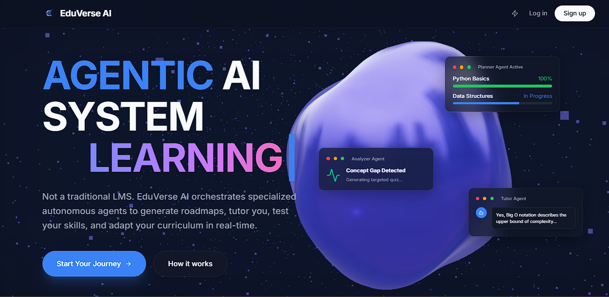
**A multi-agent, personalized AI learning platform powered by Google Gemini 2.5 Flash**

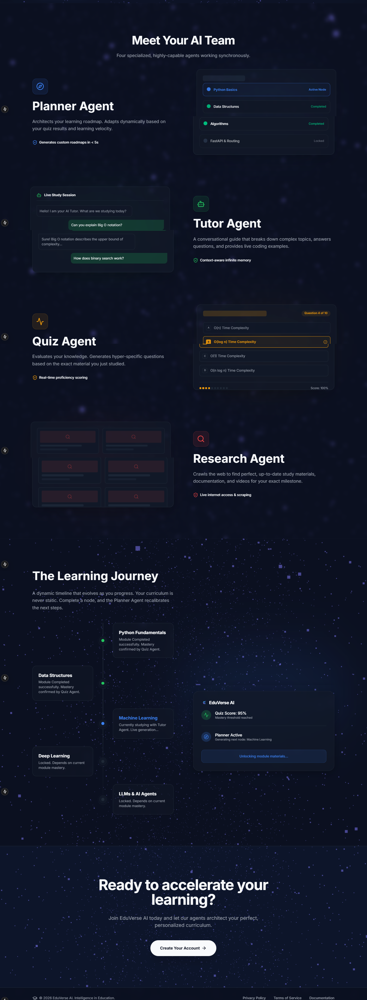

## 🌟 Overview

EduVerse AI transcends traditional Learning Management Systems (LMS). It is a **premium, AI-native adaptive ecosystem** where a coordinated team of four specialized Google Gemini agents (Planner, Tutor, Quiz, and Research) collaborate dynamically. From a single goal entry, the system generates a fully personalized curriculum, interactive study notes, dynamic assessments, and curated external resources.

---

## 🏆 Key Features & Workflows

### 1️⃣ Intelligent Onboarding & Goal Setting

Simply tell the AI what you want to learn, your current skill level, and how much time you have.
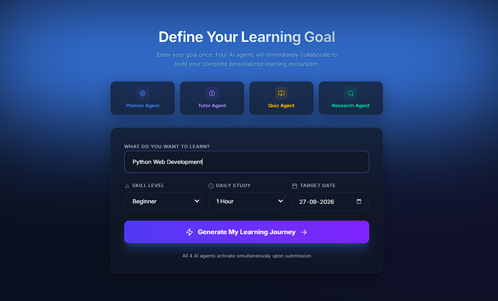

### 2️⃣ Multi-Agent Orchestration

Our architecture utilizes four distinct Gemini Agents that work in sequence to build your universe of knowledge.
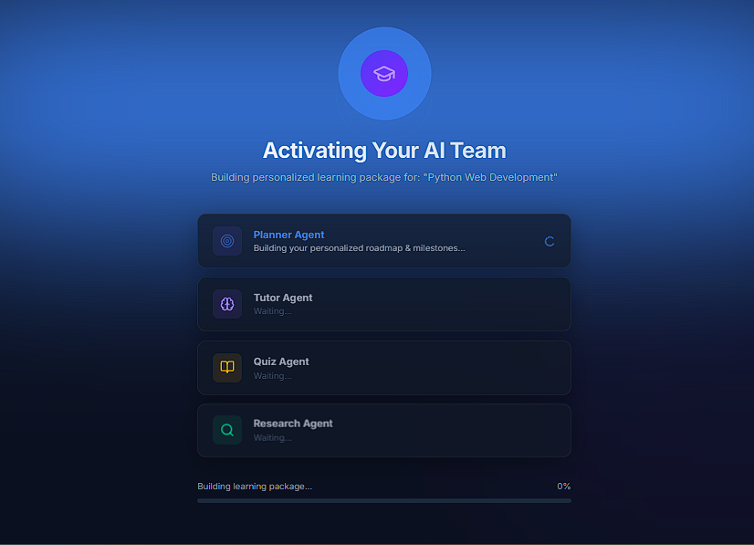

### 3️⃣ Command Center Dashboard

A sleek, glassmorphic dashboard tracking your learning velocity, career readiness, study streaks & best actions.
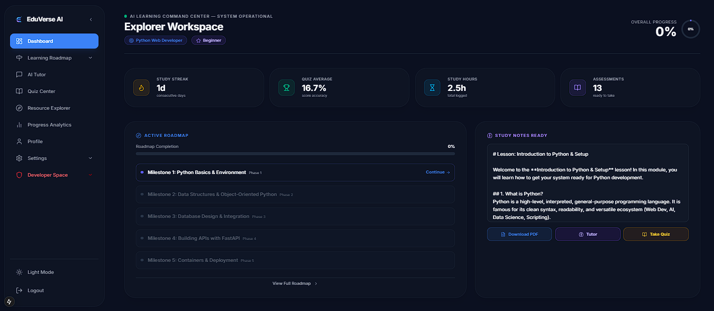

### 4️⃣ Adaptive Roadmap

Your curriculum isn't static. It adapts based on your quiz performance. Fail a concept, and the Planner agent automatically injects remedial lessons.
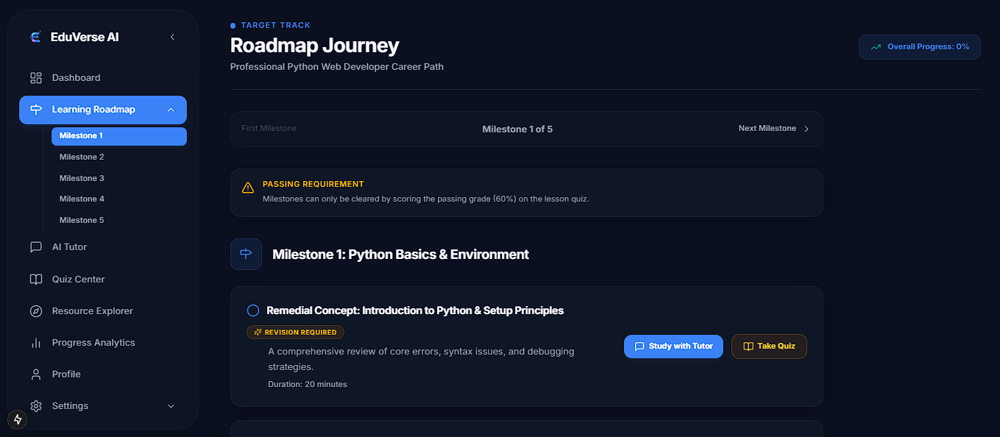

### 5️⃣ AI Tutor Console

Engage in real-time SSE-streamed conversations with your context-aware Tutor Agent for deep concept exploration.
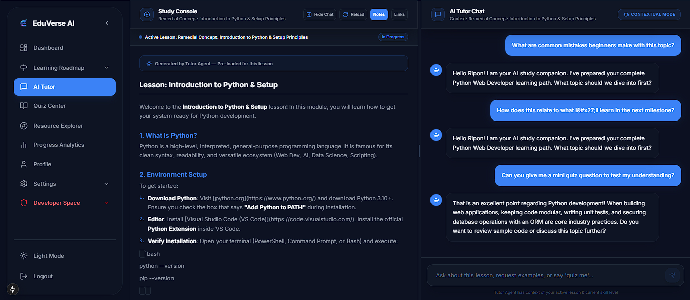

### 6️⃣ Dynamic Assessments

Quizzes are generated on-the-fly based on the lesson's exact study notes.
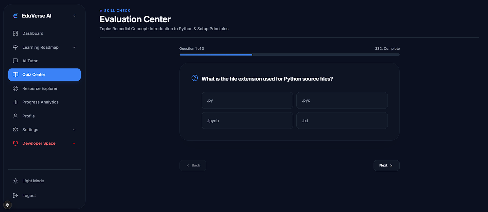

### 7️⃣ Curated Resources & Career Paths

The Research Agent scours the web (via Tavily MCP) to find the best external articles, videos, and documentation.
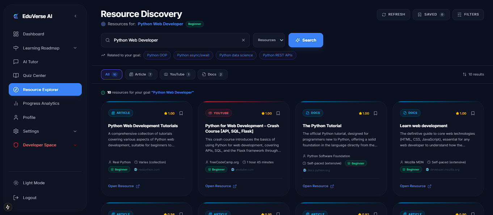

### 8️⃣ Progress Analytics & Insights

Track your learning progress with detailed analytics and insights, including study streaks, best actions, and career readiness.
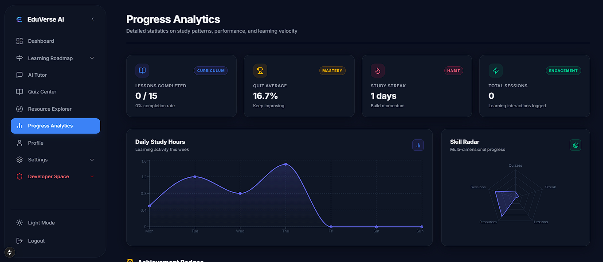

### 9️⃣ Profile Page

Learn About Current Profile & Suggestions
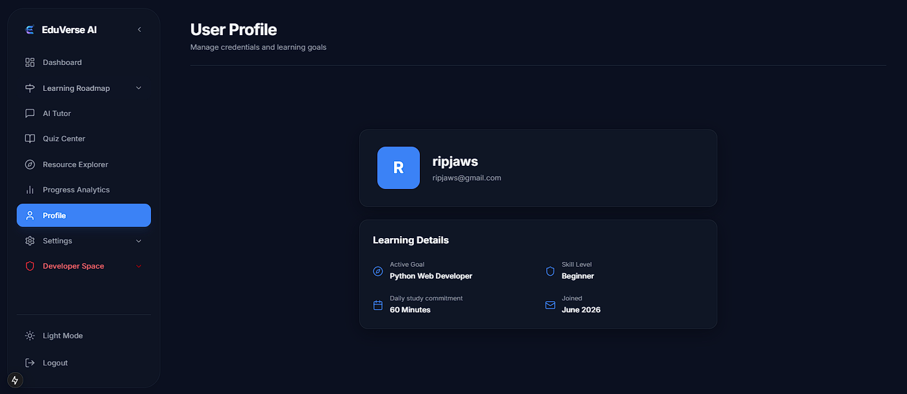

### 🔟 Settings & Profile Managements

Manage your profile, settings, and preferences.
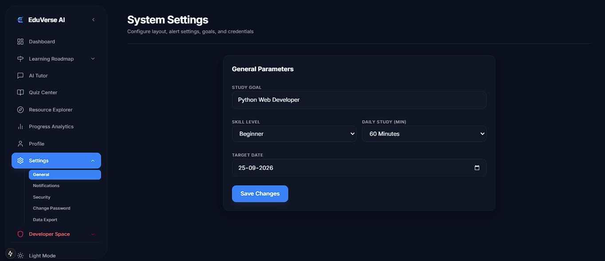

---

## ⚙️ Tech Stack

- **Frontend**: Next.js 15, React 19, Tailwind CSS v4, Framer Motion, Recharts, Three.js
- **Backend**: FastAPI (Clean Architecture), SQLite, SQLAlchemy
- **AI/LLM**: Google Gemini 2.5 Flash (`google-genai`)
- **MCP Integrations**: Tavily (Search), YouTube, PDF Extractors

---

## 🚀 Quick Setup & Installation

Follow these precise steps to get EduVerse AI running locally.

### 1. Clone the Repository

```bash
git clone https://github.com/ripongoswami/kaggle_capstone_project.git
cd kaggle_capstone_project
```

### 2. Environment Variables

Copy the example environment file and add your API keys:

```bash
cp .env.example .env
```

Inside `.env`, configure:

```env
GEMINI_API_KEY=your_gemini_api_key_here
TAVILY_API_KEY=your_tavily_api_key_here

# Set to false for real AI generation (requires API keys above)
# Keep as true to run using mock/demo data for instant evaluation
USE_MOCK_AGENTS=true
```

_(Get a free Gemini API key from [Google AI Studio](https://aistudio.google.com/))_

### 3. Start the Backend (FastAPI)

Open a new terminal window:

```bash
cd kaggle_capstone_project/backend
pip install -r requirements.txt
uvicorn app.main:app --reload --port 8000
```

_Note: The backend auto-creates SQLite tables and seeds a demo user (`student@eduverse.ai` / `Password123`) on startup._

### 4. Start the Frontend (Next.js)

Open another terminal window:

```bash
cd kaggle_capstone_project/frontend
npm install #if this dosent works use "npm install --force"
npm run dev
```

### 5. Access the Platform

Navigate to **[http://localhost:3000](http://localhost:3000)** in your browser!

> **Linux/Mac Shortcut**: You can run both servers simultaneously using: `./scripts/start.sh`

---

_Built with ❤️ for the Kaggle Capstone Project_
