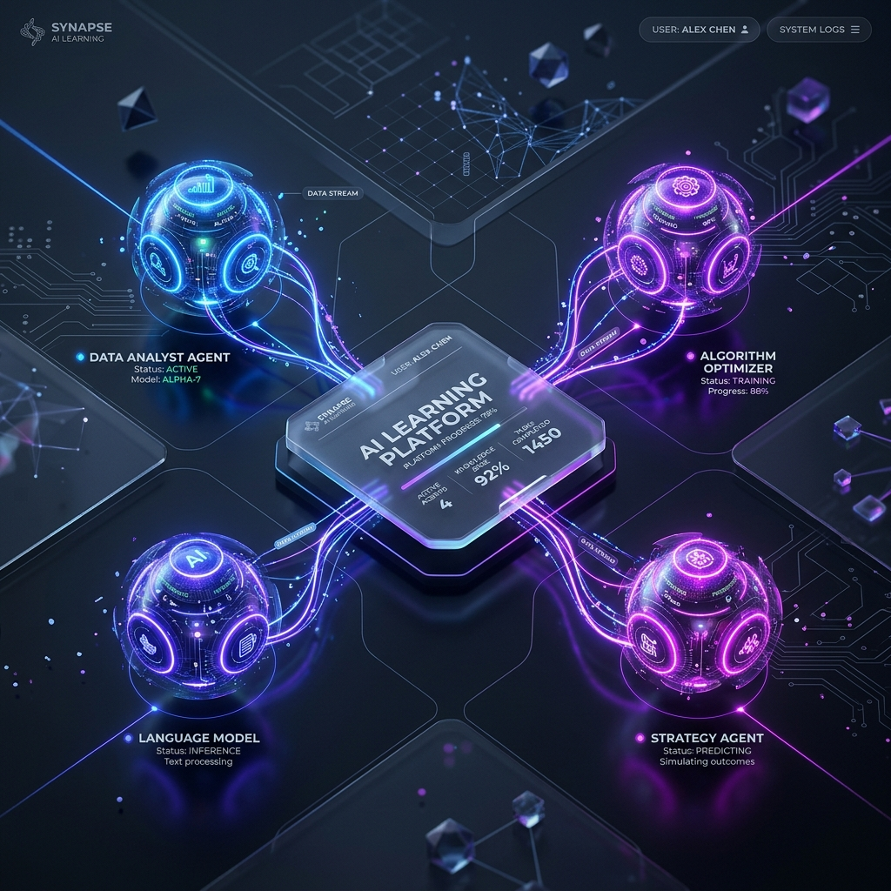
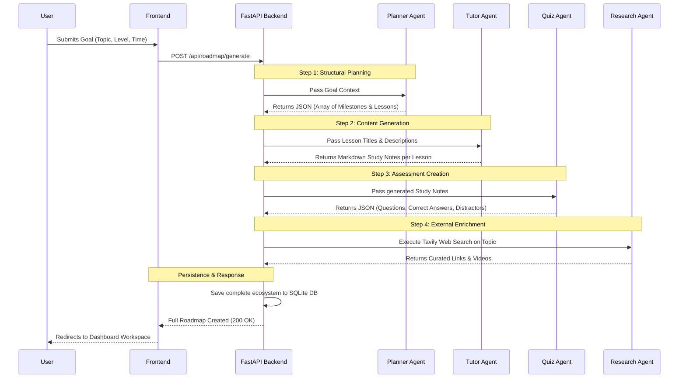
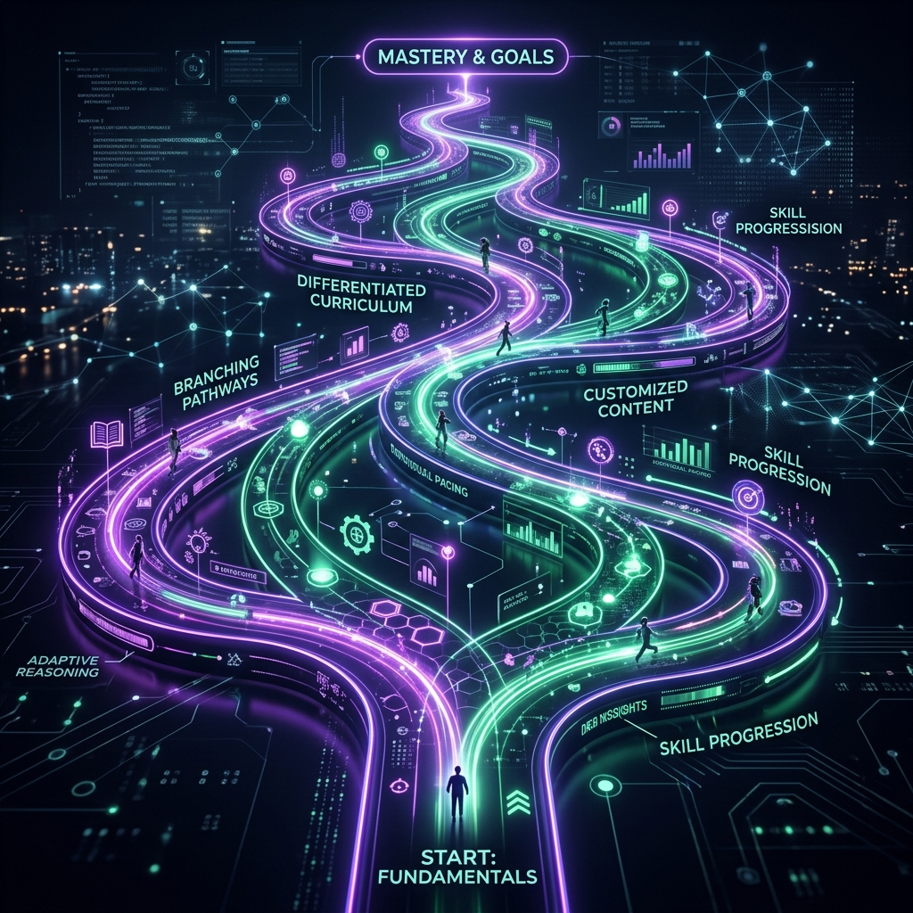
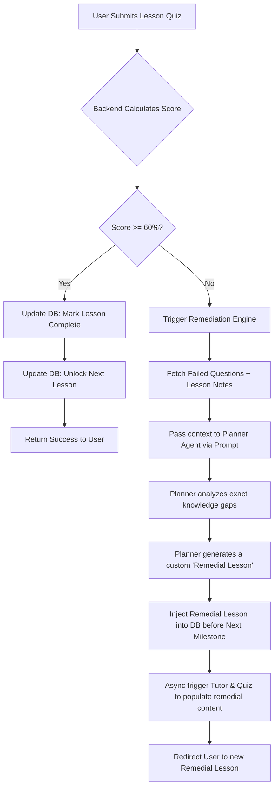
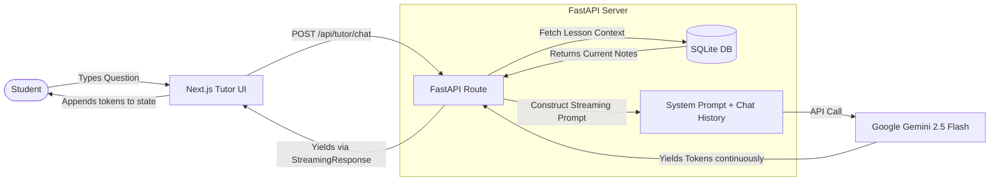

# EduVerse AI: Complete System Workflow

This document provides an exhaustive technical and functional overview of the EduVerse AI architecture. It illustrates exactly how user goals are ingested, processed by the Gemini 2.5 Flash multi-agent engine, and transformed into a personalized, adaptive, and highly interactive learning ecosystem.

## 1. High-Level Application User Journey

Before diving into the agentic pipelines, it is crucial to understand the high-level path a user takes through the platform.

```mermaid
flowchart TD
    A[Landing Page] -->|Register / Login| B(Authentication System)
    B --> C{First Time User?}
    C -- Yes --> D[Onboarding / Goal Setting]
    D --> E((Multi-Agent Engine Generates Curriculum))
    E --> F[Dashboard Workspace]
    C -- No --> F
    
    F --> G[View Active Roadmap]
    G --> H[Start / Continue Lesson]
    H --> I[AI Tutor Console (Study & Chat)]
    I --> J[Take Lesson Assessment]
    
    J --> K{Score >= 60%?}
    K -- Yes --> L[Unlock Next Milestone]
    L --> F
    
    K -- No --> M((Remediation Engine))
    M --> N[Generate Custom Remedial Lesson]
    N --> G
```


*(Concept Art: The EduVerse Dashboard, serving as the central command center for tracking learning velocity, skill gaps, and pending assessments).*

---

## 2. The Multi-Agent Orchestration Concept

EduVerse AI completely breaks away from the static LMS (Learning Management System) model. Instead of relying on a single, monolithic LLM prompt—which often leads to hallucinations and lack of structure—the platform orchestrates a team of specialized AI agents.

Each agent has a strictly defined domain, a specific JSON schema for output validation, and a distinct role in the ecosystem.


*(Concept Art: The four distinct glowing nodes representing our Planner, Tutor, Quiz, and Research agents feeding into the central user hub).*

### The Agents:
1. **Planner Agent**: The "Dean" of the curriculum. It defines milestones, sequence, and difficulty.
2. **Tutor Agent**: The "Teacher". It generates rich Markdown study notes and handles live Q&A.
3. **Quiz Agent**: The "Examiner". It validates knowledge retention via dynamic MCQs.
4. **Research Agent**: The "Librarian". It scours the live web using the Tavily MCP integration.

---

## 3. Onboarding Workflow: The Generation Pipeline

When a user registers and sets a goal (e.g., "Master Python for Data Science in 2 hours a day"), the system triggers a sequential generation pipeline. 

Because we use **Gemini 2.5 Flash**, this entire 4-stage process completes in seconds, providing a seamless user experience.



### Technical Details of Generation:
- **Structured Outputs**: The FastAPI backend forces the Gemini API to respond in strictly defined Pydantic JSON schemas. If the Quiz Agent forgets to include a correct answer, the schema validation catches it.
- **State Management**: The SQLite database acts as the single source of truth. As the agents generate content, it is committed to the database, ensuring that if a user logs out and logs back in, their personalized curriculum is perfectly preserved.

---

## 4. The Adaptive Remediation Engine (Dynamic Roadmap)

The most groundbreaking feature of EduVerse AI is its **Dynamic Roadmap**. Traditional platforms simply record a failing grade. EduVerse AI alters the future state of the curriculum based on that failure.


*(Concept Art: The curriculum pathway physically diverging and rewriting itself upon encountering an obstacle).*

### How Remediation Works (The Feedback Loop):


**Why this matters**: If a user fails a quiz on "Python For Loops", they are not allowed to proceed to "While Loops". The system automatically generates a lesson titled "Remedial: Understanding For Loop Syntax", generates new notes, and creates a new quiz specifically targeting what they got wrong.

---

## 5. The Live Tutor Console (SSE Chat Architecture)

Learning is not just about reading; it is about interaction. The platform includes a live Tutor Console where users can ask questions about the current lesson material.


*(Concept Art: A highly intelligent, sleek AI tutor interface providing real-time data streams and contextual responses).*

To make this feel instantaneous and conversational, we utilize **Server-Sent Events (SSE)**.



### Context-Aware Prompting:
When the user asks "Can you explain this again?", the backend silently injects the *entire text of the current lesson's study notes* into the system prompt. The Gemini model knows exactly what "this" refers to, providing a deeply personalized and contextually accurate response without requiring a complex Vector DB / RAG setup, thanks to Gemini 1.5/2.5's massive context window.
